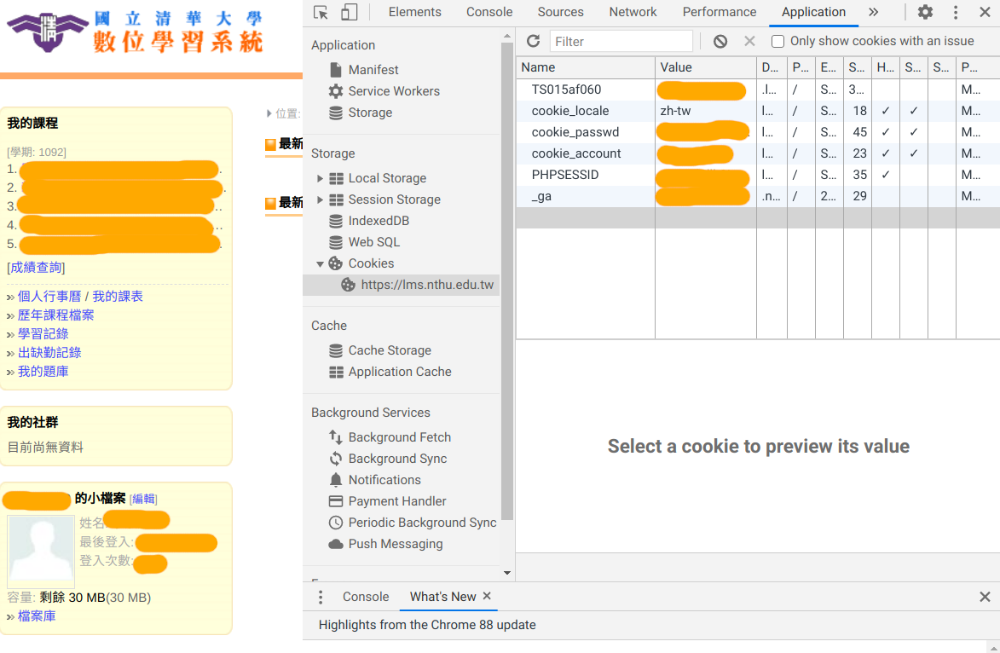

# wget_ilms
wget script for mirroring your courses from nthu_ilms

##  Requirements

On ubuntu, usually `wget` is present.  In case you don't have it,  use the following command to install it.

```bash
sudo apt install wget
```

## Get Login Cookie Info

Firstly, log in to [nthu ilms](https://lms.nthu.edu.tw/) and get your login cookie info, and then fill them in `ilms-cookie.txt`.   In google chrome, they can be found in developer console (press key `F12`) -> Application.



## Usage

Make sure you have the download script (`wgetilms.sh`) and a well formated text file with login cookie information (`ilms-cookie.txt`).

- Download resources (announcements, homeworks, lecture notes, etc.) of all courses you have taken.
  - Run `./wgetilms.sh entire` in terminal
- Download resources of specific courses
  - Usually used when some courses are not successfully download when using `entire` (mostly due to temporary network error).
  - First, In `course.txt`, list the url of courses you want to download.  One url per line.  
  - After that, run `./wgetilms.sh specific` in terminal

The webpages will be downloaded in `lms.nthu.edu.tw` directory.  You can navigate to the courses by opening `home.php?f=allcourse.html` if you used `entire` to download.